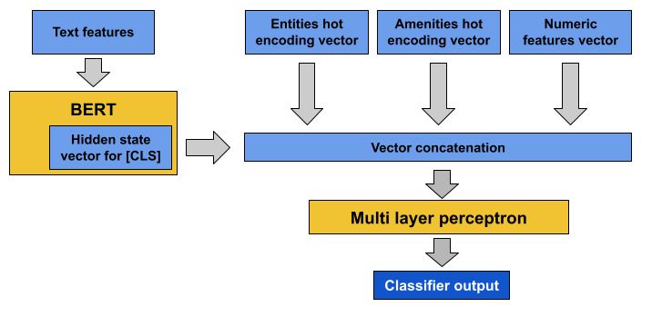

# KGE-BERT for Accomodation Offers Optimization

Implementation of the paper *Optimizing Tourism Accommodation Offers by Integrating Language Models and Knowledge Graph Technologies* (under review).

In case of problems, feel free to contact us or submit a GitHub issue.

## Content

- CLI script to run all experiments
- Airbnb data sets for all classification tasks
- One-hot encoding vectors for categorical and linked entities features 

## Model architecture




## Installation

Requirements:
- Python 3.8
- CUDA GPU

Install dependencies:
```
pip install -r requirements.txt
```

Download pre trained BERT model under *pre-trained_models* as explained in the relative [README.md file](pre-trained_models/README.md)

## Reproduce paper results

Train and evaluate the model with all experiments' settings by running the following scripts:
```
## Experiments: KGE-BERT-full, KGE-BERT-1hot, KGE-BERT-num
bash run_all_KGE-BERT_experiments_no_text_injection.sh 

## Experiments: KGE-BERT-injected-full
bash run_KGE-BERT-injected-full.sh

## Experiment: BERT, Logistic Regression
bash run_BERT_and_baseline_experiments.sh

## Experiment: BERT-injected
bash run_BERT-injected.sh
```

The results would be saved under *output_results*.


## How to cite

If you are using the code in this repository, please cite [our paper]():
```

```

## References

The code in this repository is based on [pytorch-bert-document-classification](https://github.com/malteos/pytorch-bert-document-classification)

## License

MIT


